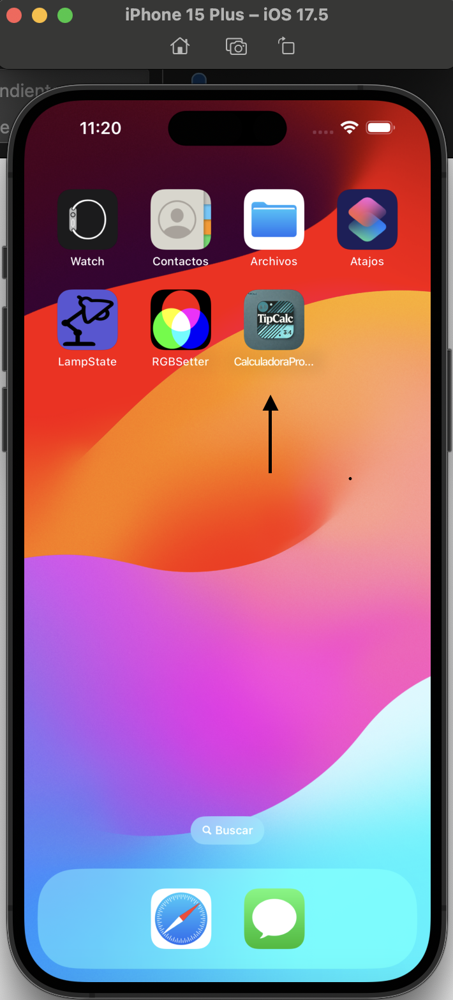
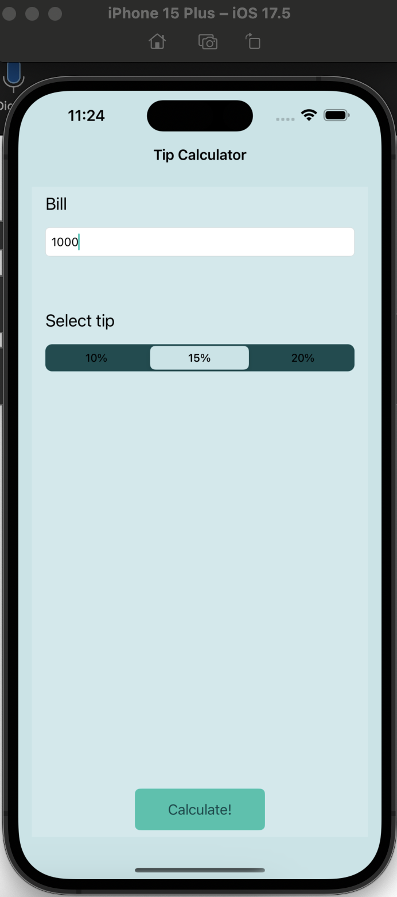
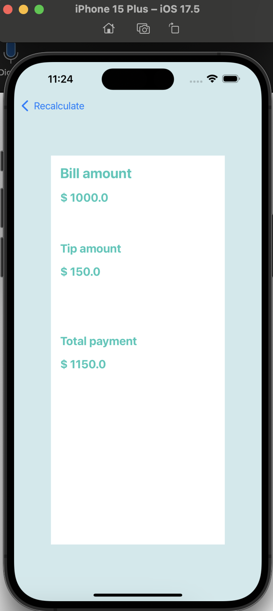
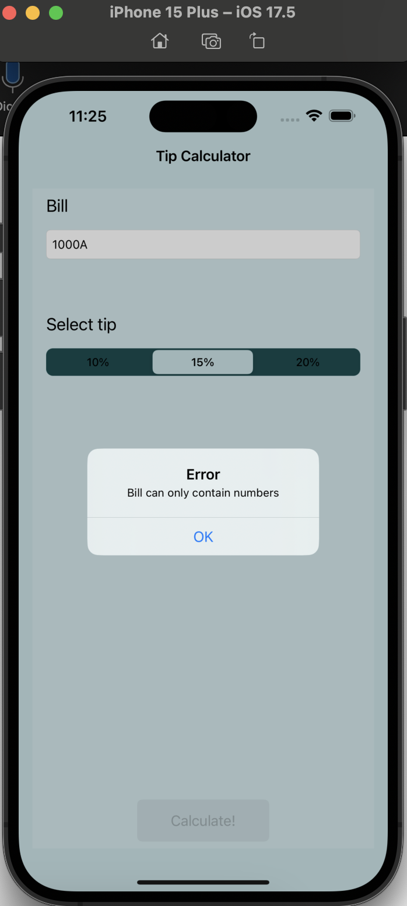

# I've been diving into iOS development recently—take a look at one of my first apps! While it handles simple tasks, it stands out with clean code and sleek design, and I’m gearing up for more advanced projects.

## What does it do? 

It helps you calculate your final bill based on the tip you choose to give.

Check out the functions in the images:

## App Icon:

## First view, where input should be placed:

## Tip calculated!

**Note: Bill input only receives numbers if a letter is passed an alert is shown**

